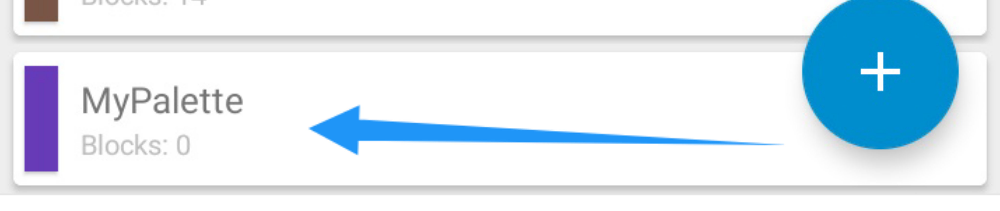
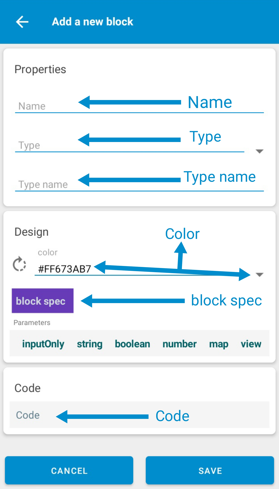

# Import blocks in Sketchware
:::caution
This doc is fully valid for the `Sketchware Pro v6.4.0 test build 05` version of Sketchware Pro. If further updates are published then this documentation may be valid or may be not valid.
:::

To create Block in Sketchware pro you need to know some terms of Block.

# Create a Block in Sketchware
Step 1: Go to Sketchware and click on 3 dots.

Step 2: Go to developer tools

Step 3: Select Block manager

Step 4: Click on Add icon.

Step 5: Enter a name for the palette name as you want and select a color by clicking on the color icon and then clicking on save.

Step 6: Here at the bottom a palette has been created successfully just click it and it will open a new screen.

Step 7: Click on add icon.

Step 8: Fill in the fields as your need and click on Save.

# Block fields
| Field | Explanation | Required | Can value be same |
| --- | --- | --- | --- | 
| Name | This is a unique name for your Block Sketchware uses this to identify different blocks. | True | No |