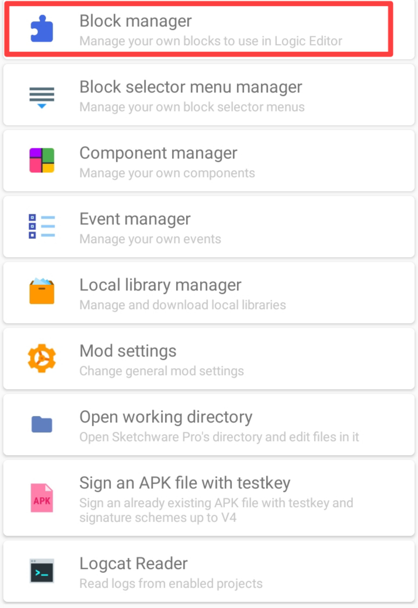
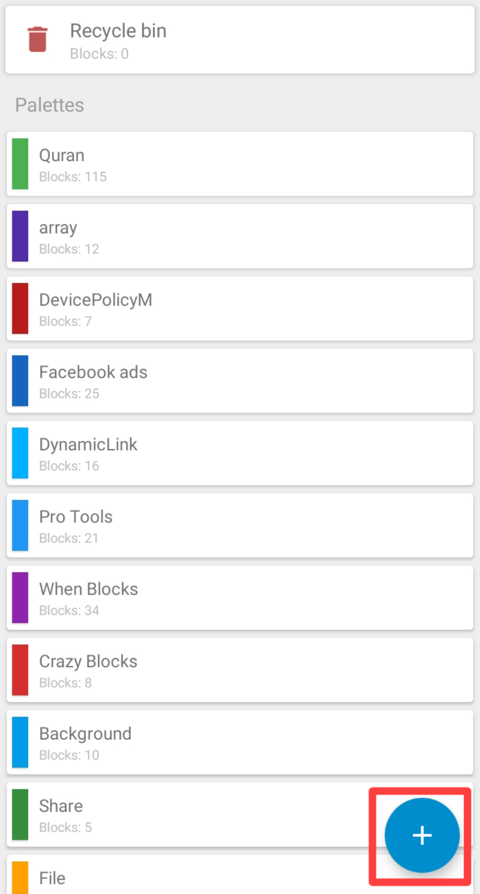
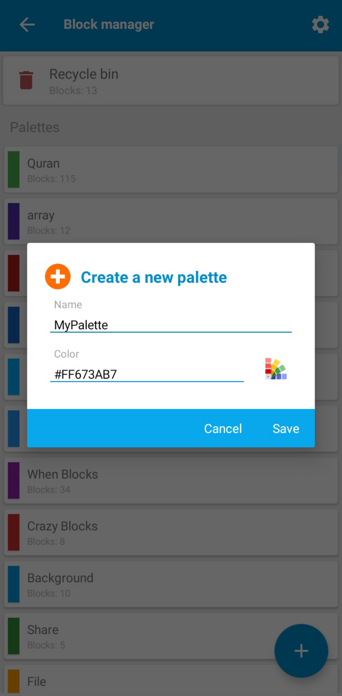
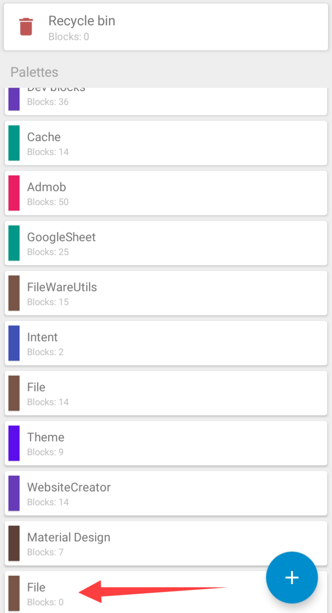
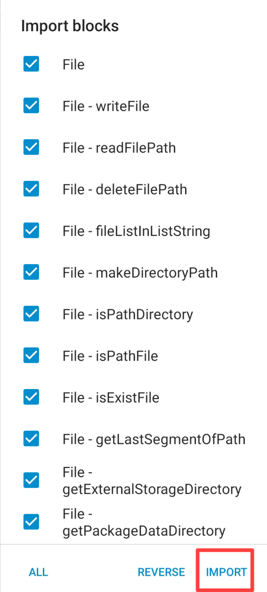

# Import blocks in Sketchware
:::caution
This doc is fully valid for `Sketchware Pro v6.4.0 test build 05` version of Sketchware Pro.If further updates are published then this documentation may be valid or may be not valid.
:::
To import block in Sketchware pro you need block file generated by exporting block.

For example I am going to use [File.json](https://drive.google.com/file/d/1BVXQmYPJ-kHlt70y4j4eZt7TpMlUOhnJ/view?usp=drivesdk) and trying to import block from this file to Sketchware pro.

Step 1 : Go to Sketchware and click on 3 dots.

Step 2 : Go to developer tools

Step 3 : Select Block manager

Step 4 : Click on Add icon.

Step 5 : Enter a name for palette name as you want and select color by clicking on color icon and then click on save.

Step 6 : Here at the bottom a palette has been created successfully just click it and it will open a new screen.

Step 7 : Click on Menu icon.

Step 8 : Click on Import block.This will open a file selector.Navigate to your block file and then click on Select.

Step 9 : This will open a popup containing the list of blocks present in that file.Select blocks which you want to add then click on Import.

Info : Blocks are imported successfully you can check it by opening project.Below is an image of the imported blocks.
