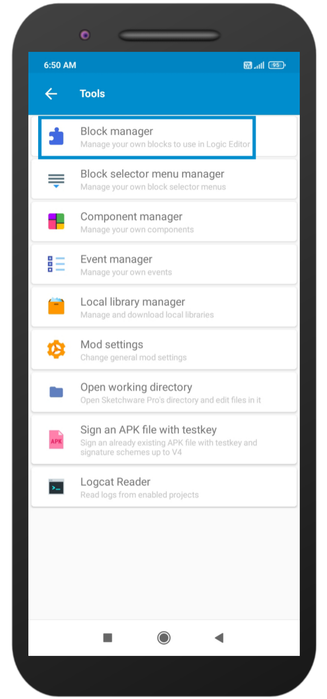
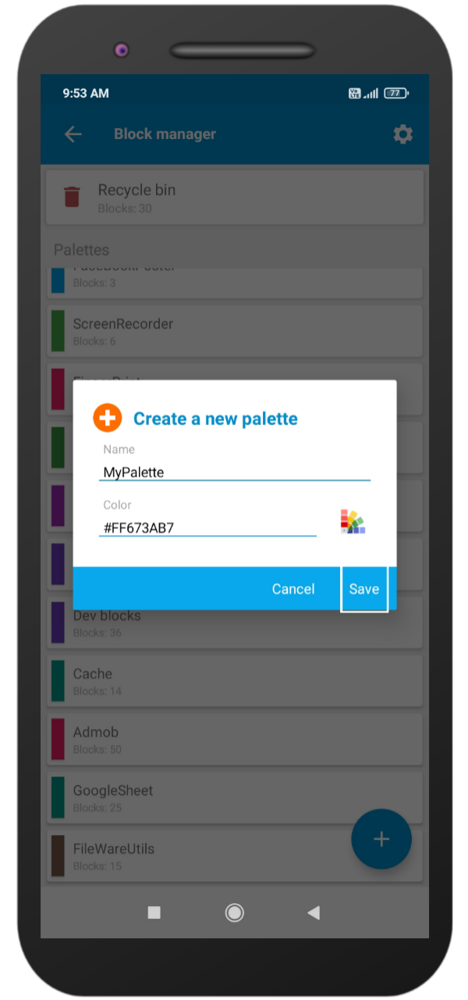
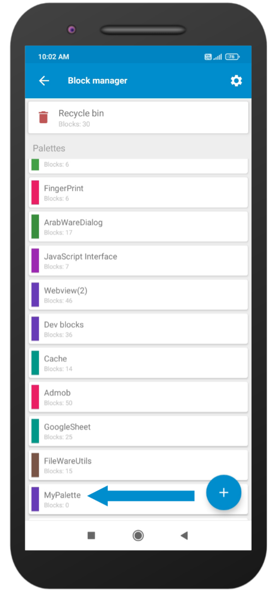

To create a Block in Sketchware Pro, you need to know some terms related to Blocks.

## Create a Block in Sketchware Pro
Step 1: Go to Sketchware Pro and click on 3 dots.

Step 2: Go to developer tools.

Step 3: Select Block manager.

Step 4: Click on Add icon.

Step 5: Enter a name for the palette name as you want and select a color by clicking on the color icon and then clicking on save.

Step 6: Here at the bottom a palette has been created successfully just click it and it will open a new screen.

Step 7: Click on add icon.

Step 8: Fill in the fields as your need and click on Save.

## Properties
| Field | Explanation | Required |
| --- | --- | --- |
| [Name](#name) | This is a unique name for your Block. Sketchware Pro uses this to identify different Blocks. The name should not be the same as other blocks. | Yes |
| [Type](#type) | Please enter value according to your block code(Eg. Void,If-then,If-else etc). | Yes |
| [Type Name](#type-name) | Read [Type Name](#type-name) | If [Type](#type) is `c` then this field is required. |

### Name
This is a unique name for a block in Sketchware Pro. It functions as the ID of the block. When you use a Block in a project, Sketchware Pro uses this property to identify each block and its associated code. The name should not be the same as other blocks to prevent potential errors.
### Type
Study the data below:
- regular

- c (if block)

- e (if-else block)

- s (String)

- b (Boolean)

- d (Number)

- v (Variable)

- a (Map)

- f (stop block)

- l (List)

- p (Component)

### Type Name
This field is required only if the Type Name is `"p"`. It indicates that the block is related to a component defined in the Type Name property.

## Design
| Field | Explanation | Required |
| --- | --- | --- |
| Color | This field determines the color of your block. | Yes |
| Block Spec | This property is used to design your block. | Yes |

### Color
The color property allows you to set the desired color for your block, enabling customization and enhancing its visual appearance.

### Block Spec
The Block Spec is a versatile tool that helps you design and structure block content. It supports various data types such as text, strings, code, numbers, booleans, and more. This empowers you to create customized blocks tailored to your specific requirements. Additionally, you can effortlessly add additional properties to expand the capabilities of the Block Spec, aligning it perfectly with your unique needs.

