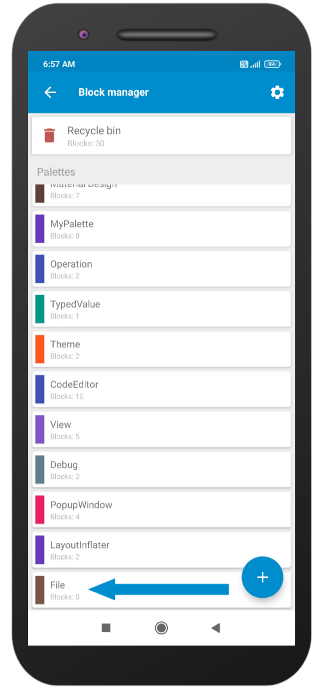
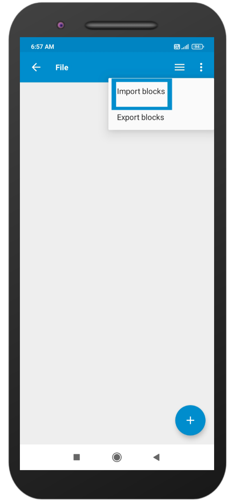

To import blocks in Sketchware Pro you need a block file generated by exporting the block.

For example, I am going to use [File.json](https://drive.google.com/file/d/1BVXQmYPJ-kHlt70y4j4eZt7TpMlUOhnJ/view?usp=drivesdk) and trying to import block from this file to Sketchware Pro.

Step 1: Go to Sketchware Pro and click on 3 dots.

Step 2: Go to developer tools.

Step 3: Select Block manager.

Step 4: Click on Add icon.

Step 5: Enter a name for the palette name as you want and select a color by clicking on the color icon and then clicking on save.

Step 6: Here at the bottom a palette has been created successfully just click it and it will open a new screen.

Step 7: Click on the Menu icon.

Step 8: Click on Import block. This will open a file selector. Navigate to your block file and then click on Select.

Step 9: This will open a popup containing the list of blocks present in that file. Select the block which you want to add then click on Import.

Info: Blocks are imported successfully you can check it by the opening project. Below is an image of the imported blocks.

