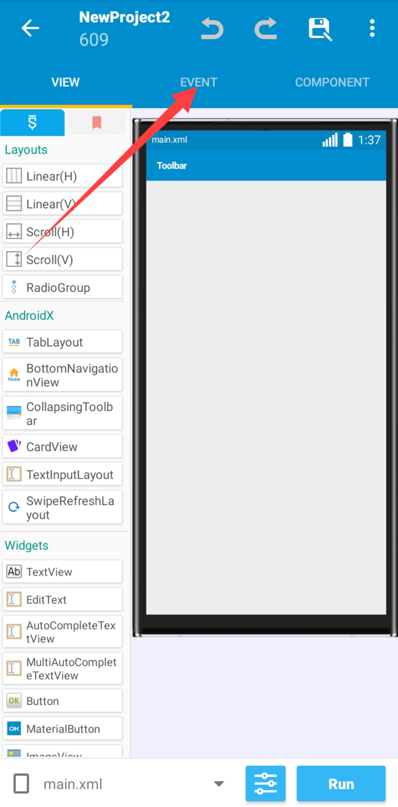
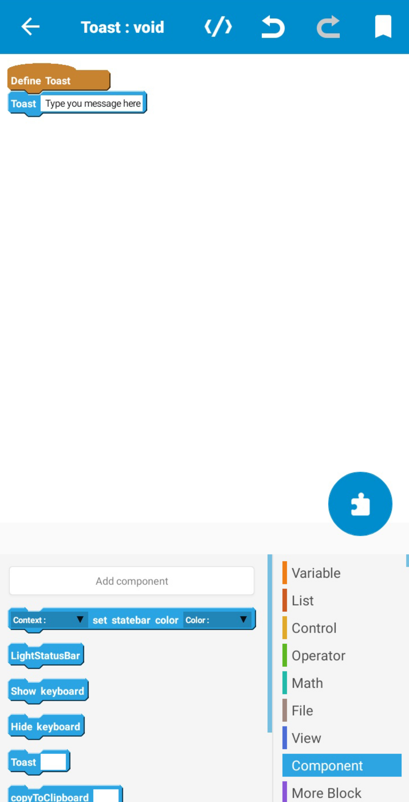
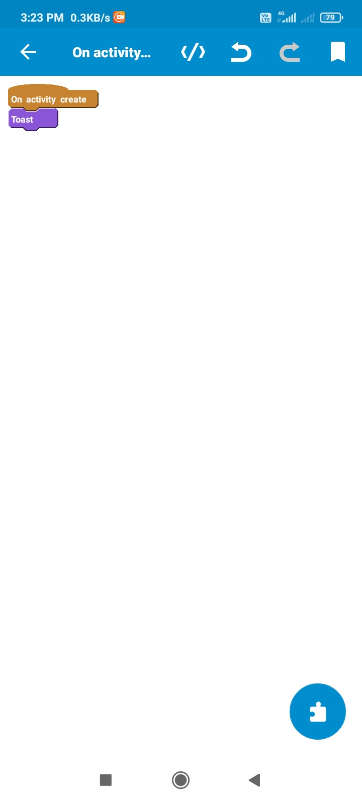

# What is Sketchware more Block?
More Block is a feature of Sketchware which easily helps developer to define a method in activity by using drag and drop.


### Parameters provided by Sketchware pro
   1. In Variable
      1. String
      2. Number
      3. Boolean
      4. Map
      5. List Number
      6. List String
      7. List Map
   2. In View
      1. View(All types of view available in layout)
      2. ImageView
      3. TextView
      4. CheckBox
      5. Switch
      6. ListView
      7. Spinner Webview
      8. SeekBar
      9. ProgressBar
      10. CalendarView
      11. RadioButton
      12. RatingBar
      13. VideoView
      14. SearchView
      15. GridView
      16. AutoComplete(EditText)
      17. MultiAutoComplete(EditText)
      18. ViewPager
      19. BadgeView
   3. In Component
      1. Intent
      2. SharedPreferences
      3. Calendar
      4. Vibrator
      5. Timer
      6. Dialog
      7. MediaPlayer
      8. SoundPool
      9. ObjectAnimator
      10. Firebase DB
      11. Firebase Auth
      12. Firebase Storage
      13. Camera
      14. FilePicker
      15. RequestNetwork
      16. TextToSpeech
      17. LocationManager
      18. VideoAd
      19. ProgressDialog
      20. TimePickerDialog.
      21. Notification

### More Block type provided by Sketchware provided
1. Void(Return nothing)
2. String
3. Number
4. Boolean
5. Map
6. List String
7. List Map
8. View

Note : You can't add More Block type rather than above

## Creating first More Block
Step 1 : Open any project in which you want to create more Block.

Step 2 : Click on Event.



Step 3 : Click on more Block


Step 4 : Click on add icon


Info : For example I am creating a Block that will display a toast message.

Step 5 : Give more Block name as `Toast` ,choose more Block type as Void(If not selected) and then click on add.


Step 6 : Open your created More Block and do as following.



Step 7 : Put this More Block on any part of activity and then run it.

Info : I am putting this more block on `onCreate`,So my toast message will be visible when the app starts.


Step 8 : Run project and install app.

Info : I placed block on `onCreate`,So my toast is visible when the app starts.

## Frequently asked questions
### Can I place More Block inside a More Block?
No,It will give you error's while compiling project.
### Where Sketchware pro will add More Block code?
```
package....;
import ....;
....

public class MainActivity extends Activity {
	@Override
	protected void onCreate(Bundle _savedInstanceState) {
		super.onCreate(_savedInstanceState);
		setContentView(R.layout.main);
		initialize(_savedInstanceState);
		initializeLogic();
	}
		
	private void initialize(Bundle _savedInstanceState) {
	}
		
	private void initializeLogic() {
		_Toast();
	}
	//More Block code goes here
	public void _Toast() {
		SketchwareUtil.showMessage(getApplicationContext(), "Type you message here");
	}
}
```
