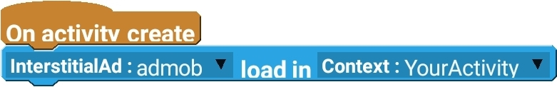
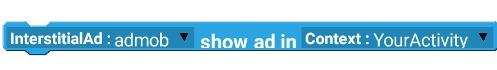

## What is Admob
AdMob is a mobile advertising subsidiary of Google, originally founded by Omar Hamoui. The name AdMob is a portmanteau for "advertising on mobile". It was incorporated on April 10, 2006 while Hamoui was in business school at Wharton School. The company is based in Mountain View, California. [Wikipedia](https://en.m.wikipedia.org/wiki/AdMob)

## Why use admob
Using admob, you can Earn more revenue with your apps.
You work hard on your app. AdMob makes earning revenue easy with in-app ads, actionable insights, and powerful, easy-to-use tools that grow your app business.

## Getting started
First we'll need to connect our app to admob. You can view that guide on their(Sketchware's) [official website](https://docs.sketchware.io/docs/admob-getting-started.html).
## In-Sketchware configuration
### Add Admob component
First add a admob component.

Give it a name, and click on `Add`.
### Initialisation
Load the ad in the onCreate event.

Now add the [onAdLoaded](#oninterstitialadloaded) event, which gets executed when the ad is loaded.
Then you will need to register FullScreen content callbacks.

Now you're done. Show the ad whenever you want to, in onClick, a component event, or anywhere else. Just make sure to follow Admob's guidelines to make sure your account doesn't get suspended.

See? Piece of cake.

## Component events
### onInterstitialAdLoaded
Gets executed when the interstitial ad is successfully loaded.
### onAdDismissedFullScreenControl
Gets executed when the ad is closed by the user.
### onInterstitialAdFailedToLoad
When Admob fails to load the ad, this event gets executed.
### onAdFailedToShowFullScreen
When the ad loads but it fails to display it.
### onAdShowedFullScreen
When it succeeds to show the ad.
## Available blocks
### Load ad
Load the ad. Recommended to add in onCreate event.

### Register Fullscreen Content Callbacks
Registers fullscreen content callbacks. Must add in [onAdLoaded](#oninterstitialadloaded) event.

### Show ad
Shows the fullscreen interstitial ad.
