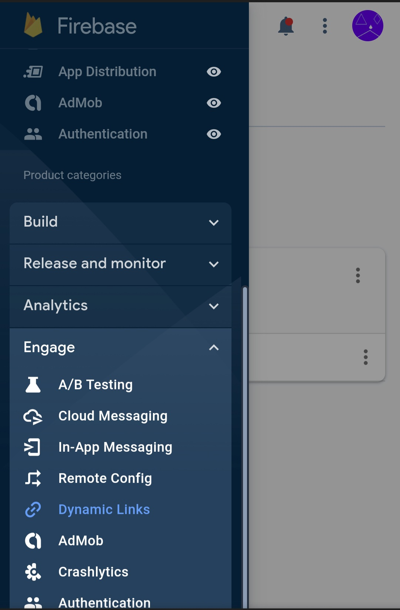

# Firebase Dynamic Links
Firebase Dynamic Links allow app developers to send their Android or IOS users to right place in their app using a simple web link. If the app is not installed, redirect the user to Google Play Store on Android, and Apple App Store on iOS. Desktop users will get redirected to your specified website.
## Configuration - Firebase
First, make sure your Android Sketchware Pro project is [connected to Firebase](/docs/connect-to-firebase).

1. Open the [Firebase console](http://console.firebase.google.com/).
2. Open a project.
3. From the sidebar, select Dynamic Links.

4. Click `Get Started`
5. It will ask you to type in a dynamic link url. Type one, and take a free domain ending with .page.link.
6. Then, click on `New Dynamic link`
7. Enter the needed information.
8. Copy the Dynamic Link URL.
## Configuration - Sketchware Pro
1. Open a Project.
2. Ensure It is [connected to Firebase](/docs/connect-to-firebase).
3. Open components tab.
4. Create a new component.
5. Select `Dynamic links` from the list.

6. Name the component and add it.
7. Initialize the component by placing this code in onStart event.
```java
FirebaseDynamicLinks.getInstance().getDynamicLink(MainActivity.this.getIntent()).addOnSuccessListener(MainActivity.this, dyn_onSuccessLink).addOnFailureListener(MainActivity.this, dyn_onFailureLink);
```
Don't forget to replace `dyn` with your component name, and also, the `MainActivity` with yours.

8. Add both events: onFailure and onSuccess, else it will show error.

The above code will toast the dynamic link which was opened before your app opened.
## Component events
### onSuccess

  | Name | Type | Use |
  | ---- | ---- | --- |
  | link | string | The dynamic link using which the app was opened |

### onFailure

  | Name | Type | Use |
  | ---- | ---- | --- |
  | errorMessage | string | The reason why it could not process the request, error message |
  