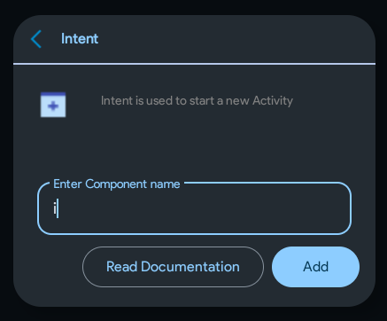
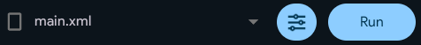
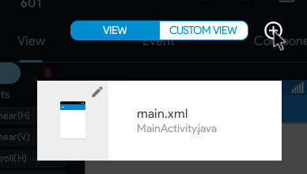
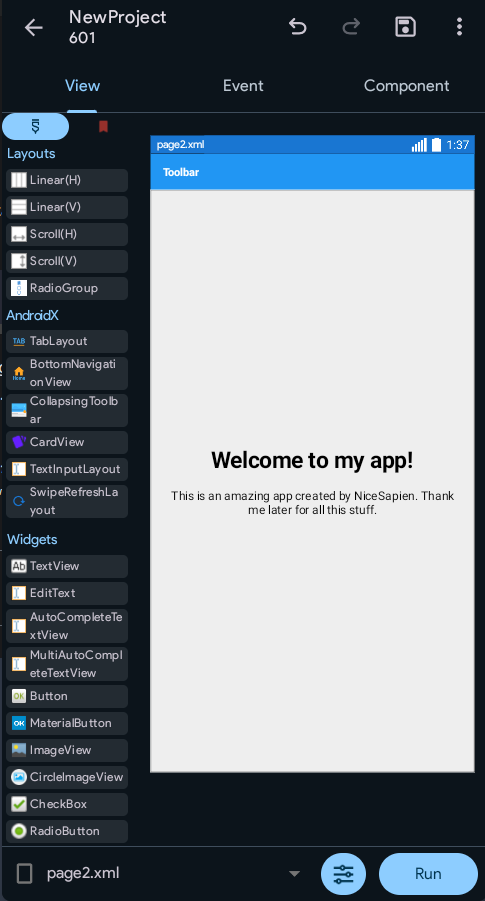
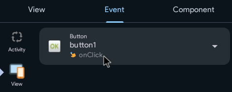
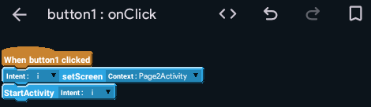
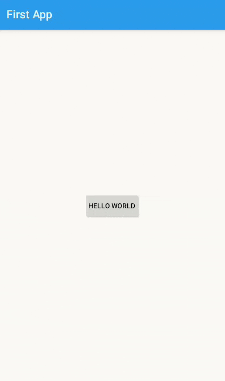

Components are reusable blocks of code that add specific functionality to your app without needing to write the code from scratch. They let you easily integrate features like showing ads, connecting to a server, or playing sounds in your project.

## Intent
An intent component is used to take the user to a website, another app, or another page inside your app. Let's begin by adding one.  
Open the component section.


Click the plus icon on the bottom-right to add a component.  
Choose Intent; it's the very first component.  
Enter a name. I'll set it to `i`.



Then, click on Add.  
The intent component should now appear in the list.

Now, before we use it, we need a new page, don't we?

## What's a page?
A website has different pages for different uses. The same goes for Android apps too. However, unlike websites, Android apps have Activities.  
Each activity in an Android app has its own files. The default ones, created by Sketchware Pro, are called *main.xml* and *MainActivity.java*. You drag and drop views, and Sketchware Pro converts them into main.xml. You add blocks, such as toast, and they are converted into MainActivity.java.

Files ending with `.xml` contain the design for an app or what you add inside the "View" section of Sketchware Pro. Sketchware Pro does the job of converting this design into XML.  
On the other hand, files ending with `.java` contain the programmatic code for your app. They contain the code of what's being done behind the scenes. This is what you add inside events. Sketchware Pro converts the blocks into Java code itself.

## Creating an Activity
It's time to create a new activity. Go inside the `View` section.  
Click on main.xml at the bottom of the screen.



Click the plus icon.



Enter the view (activity) name as `page2` and click Add.  
Now, instead of one option, you should see two options: main.xml and page2.xml. These are the two pages of your app.  
Click on page2.xml.

Do the setup. Add a Linear (V) layout. Set its width to match_parent. I won't say this again.

Set the gravity to `center_horizontal` and `center_vertical`. I'll say it again if needed.

## Designing the activity
Add a TextView. Set the text size to `30sp`. Set the text style to bold. Set the text to "Welcome to my app!"

Then, add another TextView below it. Set the text size to `16sp`. Set the gravity to center, both vertically and horizontally.  
You can write anything long in it (2-4 lines) or simply copy-paste this text:

```
Lorem ipsum dolor sit amet, consectetur adipiscing elit. Cras eleifend risus gravida porta rhoncus. Phasellus vitae congue mauris, in condimentum nulla. Vivamus tortor erat, lacinia auctor eleifend in, commodo non dui.
```

What does it mean? What is this Lorem ipsum stuff? It is simply placeholder dummy text. It is used when you're designing an app/program but don't know what to write in the text (yet). Read more and generate Lorem ipsum text at [lipsum.com](https://www.lipsum.com/).

<div class="screenshot">



</div>

This is what page2 should look like by now.  
But how does the user get to it? The default activity is main.xml, right?  
That's exactly when you use an intent.

## Using Intent
Open **main.xml** again.

Open the onClick event for `button1`.



Remove the toast block. Open component blocks.
:::info

You can open component blocks by clicking on the block icon in the bottom-right, and then selecting the second-to-last, blue-colored option: component.

:::


From here, scroll down and drag & drop the `intent set screen` block below the `When button1 clicked` block.  
Choose intent `i` by clicking on the black arrow. Choose Context `Page2Activity`.

Then add a `StartActivity intent` block, and choose intent `i`.



This is what it should look like now.

Go back and run your app. Install and open it. Try clicking on the button now, and it should take you to `page2`.




## Conclusion
Oh, what a beautiful app you have created! I can't wait to see what kind of amazing apps will you build after learning to use Sketchware Pro. Now then, that was it for today. You can rest now. Come back tomorrow for your first ever project, that's actually useful. Up until now, you've only built basic features that aren't really helping with anything. Next time, you'll also learn how to export your projects and `.apk` files to share them with your friends!

(Try some features of Sketchware Pro yourself. Maybe you'll find something amazing!?)