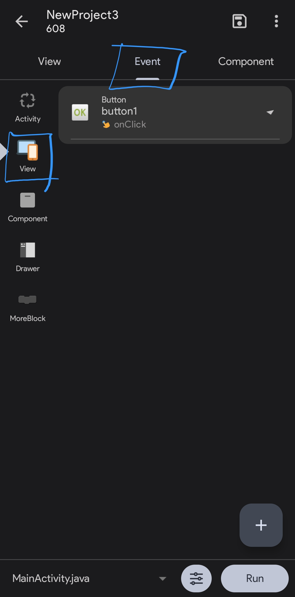
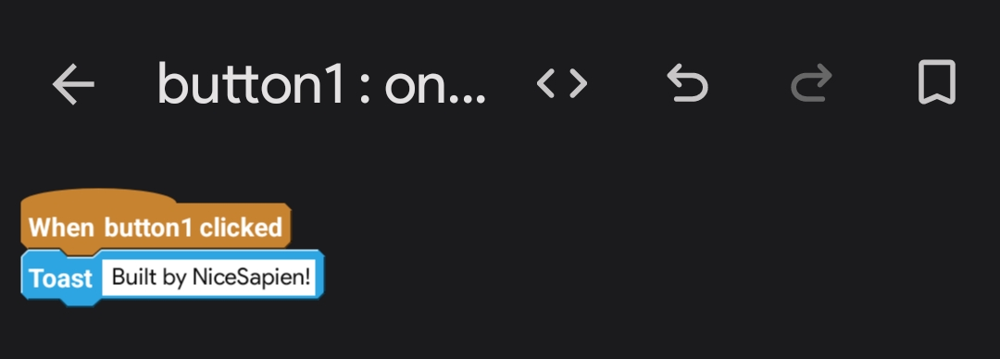

A event is a code executed when certain something happens in the app or the user performs an action. It can be when a button is clicked, when the app opens, or even when the app is closed.

## Creating a event
It's time to create your first ever event! A event contains the code that is executed when a certain event happens inside your app.
Remember the button we added [last time](view)? We'll give it a use this time. Now well, what should it do? Hmm... How about a simple toast for now?

### Button onClick

Open the `Event` section. Open the `View` section inside the event section from the left of the screen.

1. Click on `button1` to edit what it does when clicked.
2. Click the block icon on bottom right.
3. Click the last second option on bottom right, `Component`, written in blue.
4. Hold the Toast block on the left. Drag and drop it below the already-added `When button1 clicked` block. It should stick below it.
5. Click on the white space to edit the message.
6. Enter anything, such as "Built by `Your name`!"

7. You're done. Click the back button and go back to the `View` section.

## Conclusion
I hope you got a idea of what views are in a Sketchware Pro/Android app. Next, we'll try running this app on your android phone.