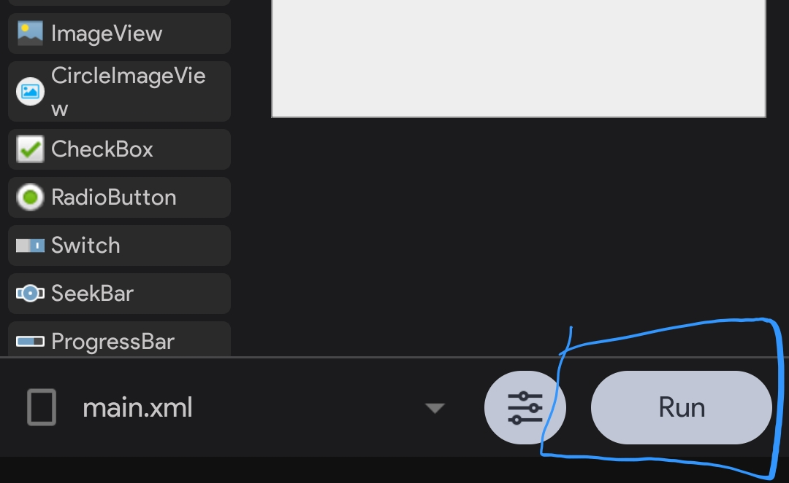
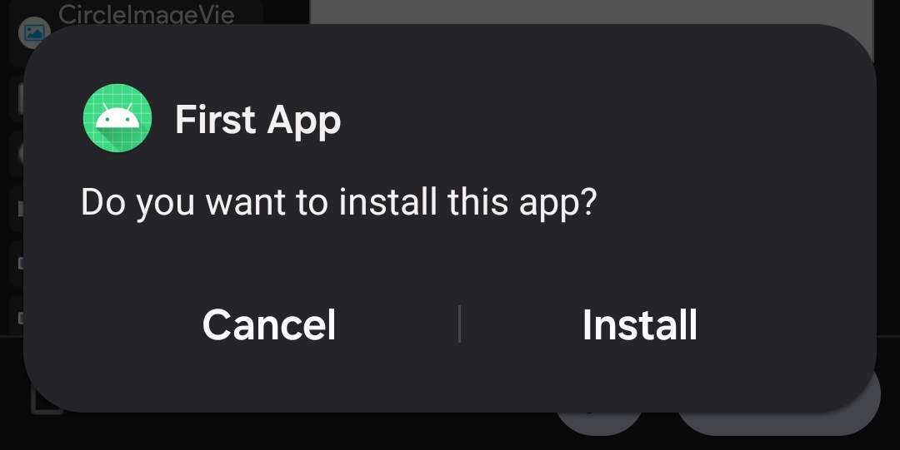
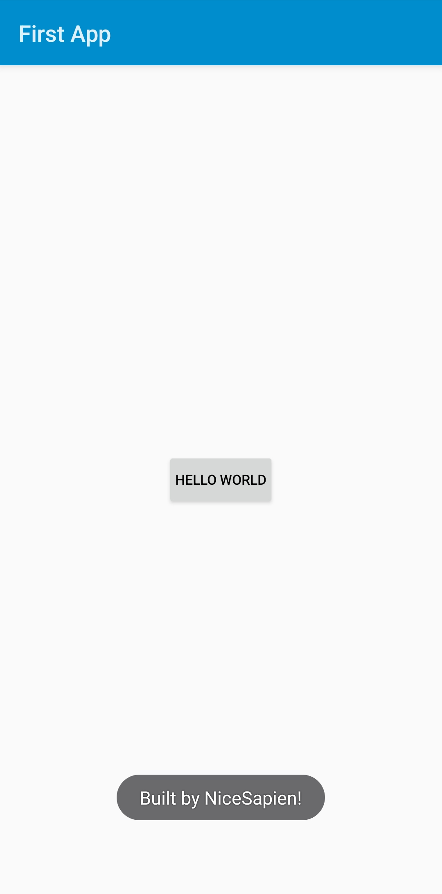

It is finally time to test your app on your android device. Sketchware Pro will do the job of converting the UI and blocks into working code and convert the code into a working android app.

## Compiling
Click the `Run` button on the bottomright corner of the screen.
Sketchware Pro should then start compiling and building your app!

Sit back and relax while Sketchware Pro does the chores.
Once the compilation is complete, give the permission to install third party apps(that's you) and click `Install`.

:::note

This UI differs from different mobile brands. However, it should be easy to understand it. It should look the same as it looked when you installed Sketchware Pro. This screenshot was taken from a Samsung Device running One UI 6.1, Android 14.

:::

You may see a play protect warning after clicking on `Install`. Click on More Details and then, `Install anyway` or `Install without scanning`

Now, click on open and open your app.

## Trying it out

Try clicking that neat button.

Beauitful, isn't it? That's your very own application, right in front of you. Celebrate with a cup of coffee.