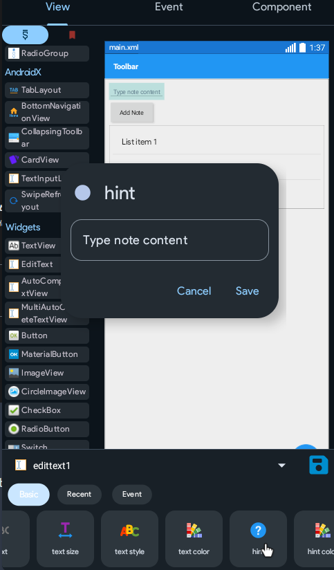
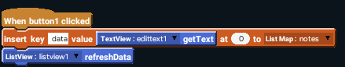
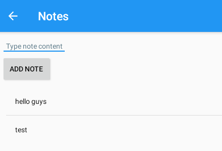
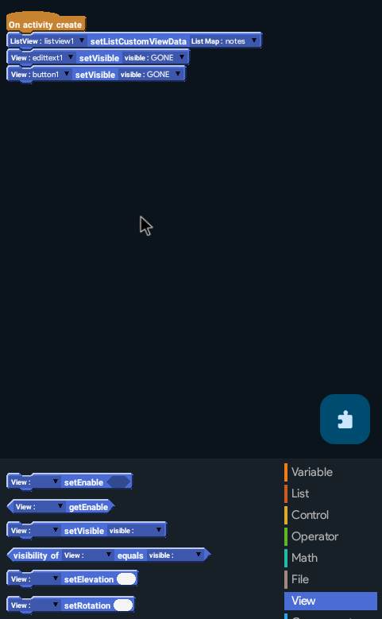
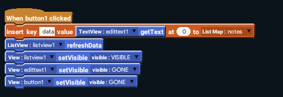
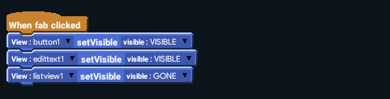

Time to allow the user to add notes to the list.

## Design
Add a EditText and a Button above the ListView.
Change button text to `Add Note`.

Change the edittext hint to `Type note content`.

Design complete. Time to program.

## Programming
Open the onClick event of the button.
(If you don't remember anything, just check the basics again! You've already been taught this.)

### Explanation
You may already know, that for a computer, 0 is 1. Which means, counting in computers start from 0. 0 is the first note, 1 is the second, and 2 is the third.
This block adds the content of the EditText in the list of notes as 0th position, which is the first position. If there is another note, it will move to the 1st position and the others will move forward too. Inserting the note at 0 causes it to appear **above** the other, older notes.

The ListView refreshData block tells the ListView to refresh its contents so the new note appears in the list.

## Almost there
You're done with the main part of the app. Try to run and install it. It should be working.

Email at [hello@sketchware.pro](mailto:hello@sketchware.pro) if you have/had any issues. You can also ask for help in our [Discord](https://discord.gg/xX6aEsnZRt) server.

But the note-adding feature always being above the list looks ugly indeed. That's why we added the fab: Which will make it visible only when you click it and invisible when you're not adding a note.

## Fab Programming
Time to program the fab.
But first, open onCreate event.

Add setVisible blocks to make the edittext and button `GONE`.
The difference between gone and invisible is that:
Invisible makes the view disappear, but still take its place.
Gone makes the view disappear AND clean the place it took. It disappears and other views adjust into its place.

Now, open the button onClick event and use set visible blocks to set the button1 and edittext1 to `GONE` and listview1 to `VISIBLE`.

Do the same in FAB onClick, but set button1 and edittext1 to `VISIBLE` and listview1 to `GONE`.

:::note

Only add the set visible blocks in fab onClick, don't add the list blocks!

:::

Run the app.

## Congratulations
You have successfully created the first project of this course! You're one step closer to achieving your certificate now!
You can move forward to the next project now, but we recommend you to test around this project first and try to add delete projects functionality.
We know that the added notes get deleted after you close the app, but you will know how to fix the issue yourself after completing the course.