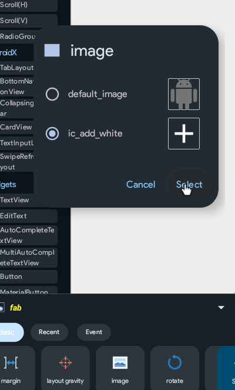
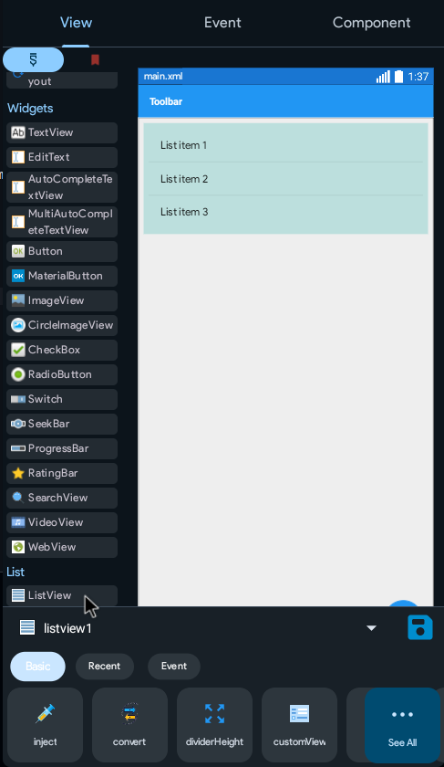
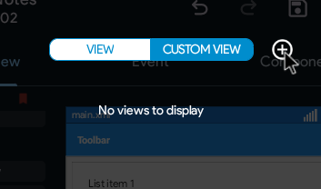
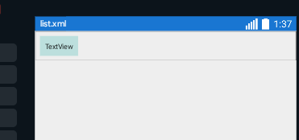
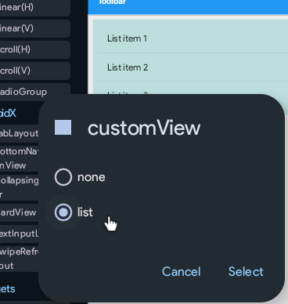
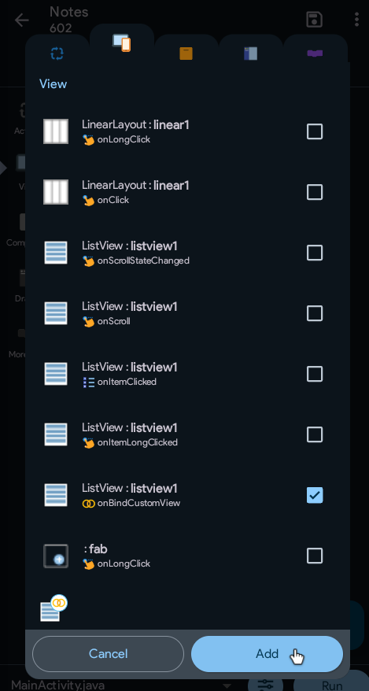
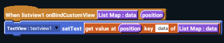
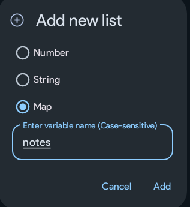
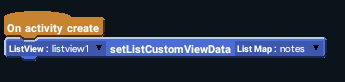

Now, we need a way to show the list of notes to the user, right?

## Fab Image

Tap on the blue dot on the bottom right of your app(that's the fab), and select the newly added image(add icon). It may appear black in color. That's okay.

We will add the function of the fab later.

## ListView
We use a ListView when we need to display a list of items in our apps. An example is the gmail app on your phone, it shows the list of your emails.

Our app however, won't show the list of emails, but the list of notes stored by the user.

Drag in a ListView from under List on the left.
Don't worry, these three are only sample list items. The list will look as you design in the final app.

## List Design
It's time to design what each list item will look like!
Click on main.xml on the bottom. We'll call this activity selector now.

Open the CUSTOM VIEW section and create a new one. Just name it `list`.
Now, a custom activity/view is very different from a normal one. Don't design it like a normal one.

Drag in a Linear(H).
Place a TextView inside the Linear.

This is what list.xml should be looking like now. Return to main.xml.

Click on the ListView. Select the "customView" property and set it to list.

## List Program

Go to Event>View>+ and add the listview1:onBindCustomView event.

Open the newly added event.
From View blocks, add a TextView setText block.
Then move to List section and drag the [get value at () key [] of [List Map]](/docs/blocks/list#get-value-at--key--of-list-map) block into the white input area of the TextView block.
Then pull in the `position` and `List Map:data` blocks from the default block.
Set the key to `data`.

This is what the event should look like now.

Now, open the main screen. Go to Event>Activity and open the onCreate event.
Go to List blocks, click Add list, type in the name "notes" and select Map as the type.

You should now see even more blocks. Open View blocks.

Add the above block in the same way.

## Explanation

This might sound complex here, but it's simple. You will understand it yourself later if not here.

A custom view is a view that loads inside of **another** view. For example here, you created a custom view for the list, however, it will appear in the main activity.
Then, we set `list` as the customView of the ListView. This was to tell the list that it has to load the custom view `list` inside it. Then, that TextView we made - its content can be changed using blocks. So we added onBindCustomView event, which is like the onCreate event of the Custom Activity. We added a get list block there. It's explanation is available [here](/docs/blocks/list#get-value-at--key--of-list-map). This will set the content of the TextView to be the user's note. Since there will be multiple notes, the position block tells what position of the note/list item is being loaded right now. The List Map:data is the variable that contains all the blocks. Later, we tell the ListView that the List Map:data has to take data from the list map `notes` inside the onCreate event.
However, there is no way for the user to store anything the variable `notes`, so we'll do that next.

Return to the main screen. The ListView is now complete. Time to allow the user to store some notes.