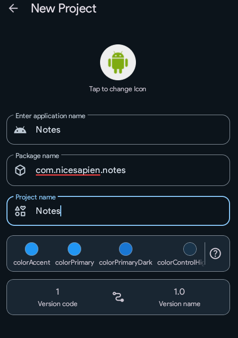
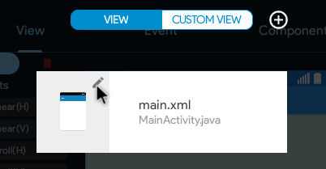
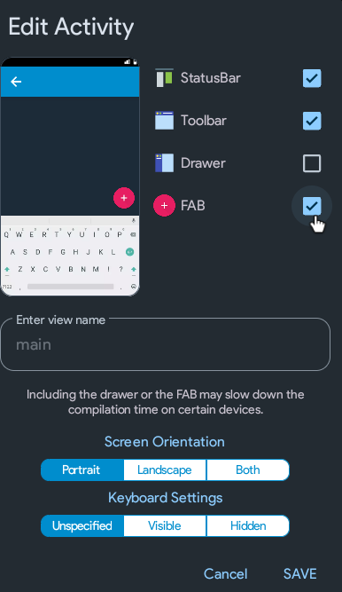
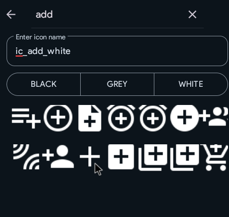

It's time to setup the new project. Instead of editing your existing project, we'll create a new one. Save the existing one as your legendary first app.

## Creating a project
Click the new project button, and fill in the following values:

Remember, it is your choice to fill whatever you want. The Application Name will be shown to the users as well. Package Name **has** to contain atleast one dot(.). I've entered com.nicesapien.notes, but you can enter something else such as com.yourname.yourappname as well. 
Click on Create Project.

## Design

As you do before, begin by adding a Linear(V).
Set the width to `match_parent`.

Now, click on main.xml on the bottom of the screen.

Click on main.xml's image.

Enable FAB and click SAVE.

Open main.xml now.

## Image Manager

Click on the three dots on top-left and open the image manager.

Now, click the download icon on the top.
Open the section: WHITE and search for the add(+) icon.

Then click on the Save button on the bottom.

Setup is complete.