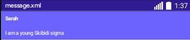
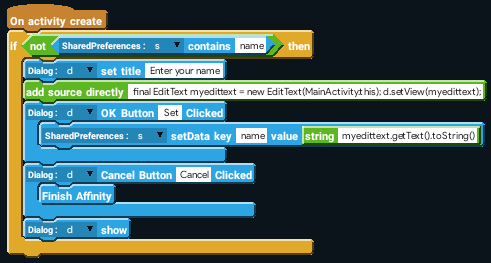

It's time to place blocks and build this thing. But before that, you need to create a custom view to assign it to the listview.

Design it like so(or better lol) and assign it to the ListView.

## User Setup
Now, *how* do we know what the name of the user is? Like in the example, we set the text to Sarah. How will we know that the user is Sarah?
Well, the obvious answer is: ask them for it. 

So, when the user opens the app for the first time, make sure to ask them for their name!
:::info Protip

Try using a [EditText Dialog](https://youtu.be/xDSrpG_NY_0?si=N83LnC2Ne-0etQ9x) to collect usernames. Alternatively, you can ask for the name in another activity.

:::