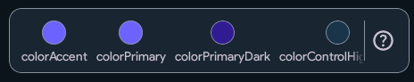
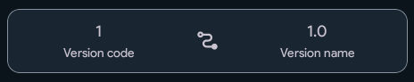
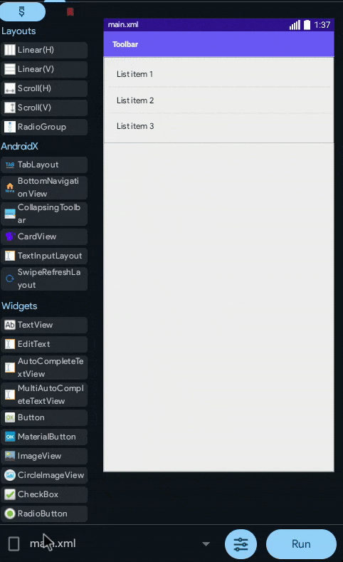
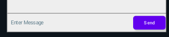
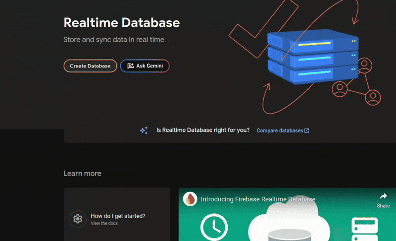
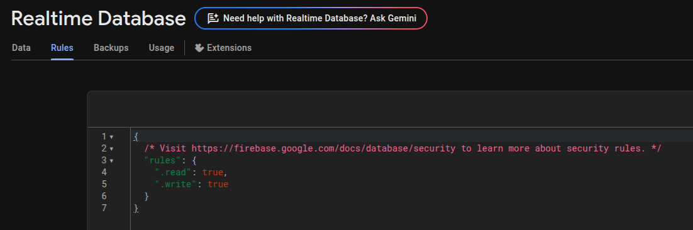

It's time we build the final project of the course. It's going to be a chat app.
However, to make it more challenging, I won't tell you what to do all the time. I'll also leave you to figure out a few things yourself.

## Creating the Project

First off, begin by creating a new project. This time, let's also do something extra to make our app look prettier. Before clicking that "New Project" button, I need to explain what colors and version code thingies mean.

Set the colors to whatever you want. I'll be setting #6c63ff for the primary and accent color.



I don't need to explain what this is, you'll know once you run your app.



Now, this is *very* important, so hear me out. The *version code* will be used when you publish your app to an app store - like the Google Play Store. It can only be a simple number; and has to be different in every version. Even in Alpha and/or Beta versions of your app published on the Play Store.
So lets say you initially publish your app with version code 1. When you update it, you must change it to 2, and then to 3, and so on. Also, if a user tries to update(technically downgrade) your app to version code 1 when they already have 2 installed, they won't be able to.

Now, the *version name*. Although not as important, but still very important.
You might've noticed games like Minecraft having updates and versions like 1.20, 1.21, 1.22 etc.
That is the version name of the game. For identification for yourself or maybe the users too. The version name can be basically anything, even english words.

However, Minecraft's versions don't just end at 1.21, they're like 1.21.40, 1.21.50 etc.
So the number at the end means a minor update and the number in the middle means a major update

**So, what's the 1 in the beginning for?**

It's for updates with a complete revamp; where the entire thing is literally rebuilt. Like, "Minecraft 2" or "Minecraft Gen 2".
Although you don't necessarily need to use this kind of version system, you are free to develop your own versioning system or check out this guide on android devs' site: https://developer.android.com/studio/publish/versioning

Finally, click "New Project".

## Basic Design
Now, we know that chat apps have a list of messages, and a text field to enter messages and send them.
That's a basic chat app. So, I want you to design a activity with a ListView.

But, uhh... How do you put the edittext at the bottom of the screen, just like every chat app? Well, here it is:

<div class="screenshot">

</div>

Now, add a EditText and a Send button inside the new LinearLayout.

Make sure to use a MaterialButton, and make the following modifications to the EditText:
```
Text Size: 14sp
Background Color: Transparent
Hint: Enter Message
Weight: 1
```

Good Job. It should now look like this:



## Firebase

Ah yes! Finally, you'll be using [Firebase](https://firebase.google.com) in one of your apps!
Check out [this guide](/docs/components/Google/Firebase/connect-to-firebase) to see how to implement firebase in your Sketchware(Pro) apps.

After implementing firebase into your app, enable Firebase Realtime Database.



:::info

You don't necessarily need to set your server region to Singapore. You can set it to whatever is closest to you.

:::

After enabling it, copy the Database URL and put it inside your Firebase configuration in Sketchware Pro. Also, make sure to set the rules' read and write to true.



Now, the basic setup is complete.... I guess?