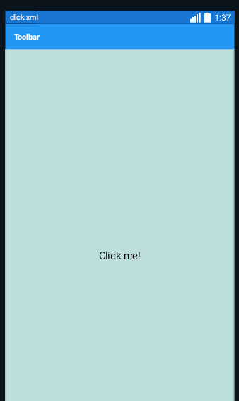
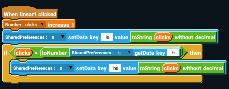
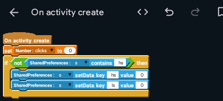

Design click.xml like this:

## linear1 onClick
That's right, you can add the onClick event in linear layouts too.

Add a Number variable named `clicks`. Also, add the exact same Shared Preferences component s:s

Add the blocks like below in the linear1 onClick event:

And like below in the onCreate event:

Your app is now ready. It's kinda trash, so here's a few things you can do to make it better!

1. Add a timer: It can be 1 second, 5 seconds, or even 10 seconds!
2. Replace the linear's onClick with a button's onClick
3. Show the number of clicks when the user is clicking

I also suggest you to modify your notes app so the notes are saved using Shared Preferences. As a protip, you'll have to use the `List Map to Json String` and `Json String to List Map` blocks!