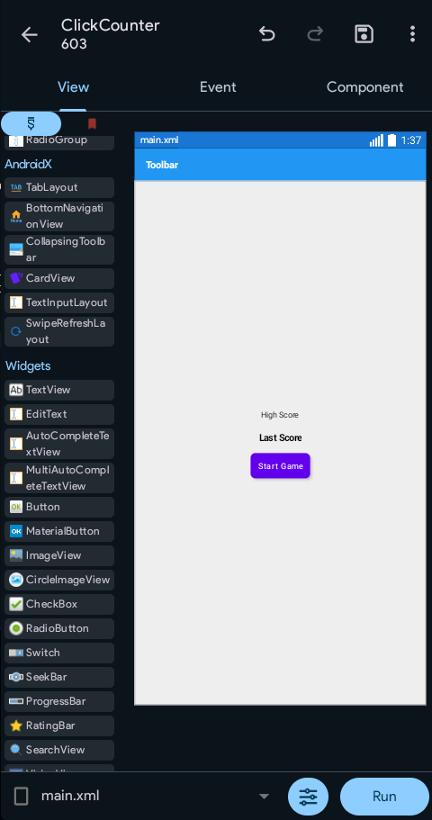
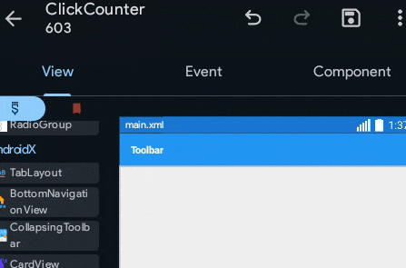
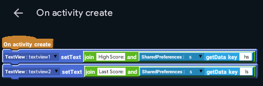
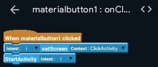

It's time to design the home screen of the app!

## Designing
Start off by adding 2 TextViews into the home screen and aligning them to the center using gravity of the linear layout.

Then, add a MaterialButton. This time, we'll be using a Material Button instead of a normal button.

### What's a Material Button?
[Material Design](https://material.io) is a design language developed by Google for Android. It's a beautiful, colorful, and accessible design language that Google suggests all apps to use. While it's totally okay to create our own design language, using Material Design is easier. The latest version of Material Design is Material 3, or "Material You". This latest version is the one Sketchware Pro uses.

A Material Button is a pre-designed button which obviously looks better than a normal button.

## AppCompat
Now, try to `Run` the app.

Observe the bottom of the screen. An error, huh?

Click on Show.
Don't understand? No problem. You will, soon.

But I'll tell you the solution: Enable AppCompat.

### What's AppCompat?
AppCompat allows you to add additional features to your app. Most of the big apps use it.

### Enabling AppCompat
To enable it, look at the top right of the screen. You'll see a few buttons: Undo, Redo, Save, and More Options(three dots)

Press the three dots. A drawer with several options will open. Now, click library.

Hit AppCompat and Design. Enable it.

:::info

The mouse pointer you see is a fake to make it easier for you to know where to click, this is actually being done on a mobile.

:::

## Run
Try running the app again! It's gonna work this time. Don't be happy yet though, it's not ready.

## onCreate
Open the onCreate event now.

Add the following blocks:

Make sure to put a empty space after `High Score: ` and `Last Score: `!

## onClick materialbutton1
Add the button's onClick event and a intent component `i`.
Take the user to ClickActivity when the button is clicked.

Your work on MainActivity is nearly complete. Now, copy onCreate to the onStart event. I'll leave you to figure it out.
Let's move to click.xml