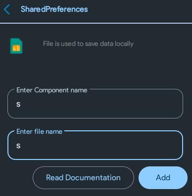

Many might call this app easier than the notes app. Many might also call it useless. While both of these terms are true and do actually apply to this project, atleast you'll learn something.

## Creating the project
By now, you should probably already know what has to be done when creating a new project. After creating it, make sure to do the basic activity setup - by adding a linear layout.

## Creating the second activity
Create another activity - name it `click` (aka click.xml).

This is the activity where you'll *actually* be hitting your phone's screen like an idiot.

## Shared Preferences
Introducing a new component: Shared Preferences. 

This component is used to permanently save some data into the user's device. You might have noticed that the notes app deletes the notes each time you close and open it, right? It's because we weren't saving it into the memory. Shared Preferences help us do exactly that.

:::info

Shared Preferences are a good way to store user data. However, if the user uninstalls your app, the data will be cleared. Since the data that we'll be storing is just high scores and they aren't very important, it's safe to use Shared Preferences!

:::

Open the components section and add a shared preferences component. But wait, what's this new "Enter file name" thingy?

Just enter `s`. When you have multiple shared preferences and don't want the data to be mixed up, you can enter different file names. Remember: The component name can be anything, but the file name must be same everywhere in order to access the data. Try messing with these names yourself for more precise understanding.

Setup is done. Let's move ahead.