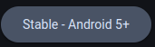
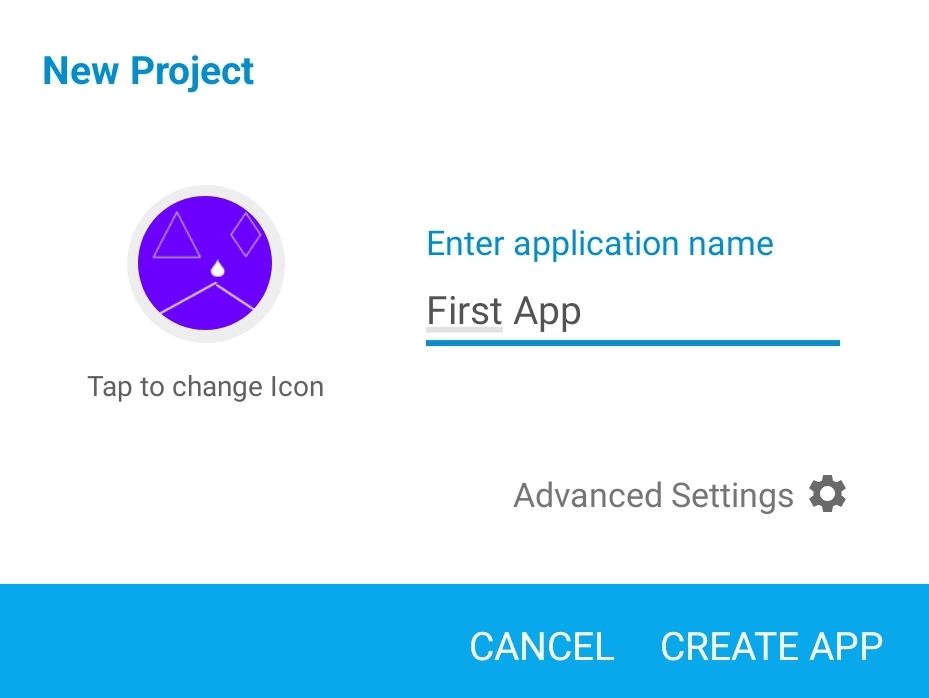

# Introduction
The Sketchware Pro course is for complete beginners who have never programmed before. This course will walk you from being a complete beginner to a absolute pro, and you will be able to build apps of your own ideas by the end of this course. You will also get a free certificate for completing this free course!

## Who am I
Before telling you more about the course, I want to tell you about myself.
I'm NiceSapien. A teenage developer from India. I am the one who created this course. Although I'm primarily a web developer now, my interest in coding and programming was caused by Sketchware. I will be your guide throughout the course.

## About the course
Throughout the course, you will learn several new things and features of Sketchware Pro. You will have to complete 6 projects to get your certificate. Once all 6 of them are made, DM the .swb files to @NiceSapien on [Discord](https://discord.gg/xX6aEsnZRt) to recieve your certificate!
You can also join the Discord server if you have any questions or need help.

## Setup
It's time to begin. All you need is a Android smartphone or tablet to be able to create epic Android apps using Sketchware Pro.

Here's how to setup Sketchware Pro.
1. Download it

Download Sketchware Pro from the [official website](https://sketchware.pro/download)

If you're on Android 5, 6, or 7, download the Android 5+ version.

Other users who use Android 8 or above, download the Android 8+ version.

2. Install it

Open the downloads folder of your device or browser. Tap on the .apk file and click Install. If any warning appears, click Install Anyway. Sketchware Pro is safe to use and its [source code](https://github.com/Sketchware-Pro) is available on GitHub.

3. Open and Grant all the permissions

Once it has been installed, open it and allow it all the permissions, including the access all files one. Sketchware Pro needs storage access to store your projects on your phone to keep them safe.

**And that's it! Setup is complete!**

## Creating a project
:::warning

This UI may seem different than the actual app. This is because these screenshots were taken before the release of the m3 version. The features and their positions remain the same, though.

:::
It's time to create your very first project. Click the plus(+) icon on the bottomright corner.

Now, enter your project details. You don't need to click on advanced settings. We will dive deeper into them later. 
For now, enter a name for your project.

You can also optionally add an icon by clicking on "Tap to change icon".
Click "CREATE APP".

Once the project has been created, you will see a project designing UI. See the next page to know more about it.

## Frequently asked questions
### Why the ads?
Sketchware Pro itself has no ads. These are only present on the website. We are giving you a full course and a certificate, 100% free. We need money to maintain and keep this website and course up and running. We don't demand any money or donations, we only request you to not use a adblocker🙂

### How long is this course?
It completely depends on you. However, on average, people complete it in less than 2 weeks.

### Is this worth it?
**Yes**, this course is absolutely worth it. You can learn a lot about Android development, programming & coding, and logical thinking from this course. These are among the most important skills to get a good job as a Software Developer or Engineer.