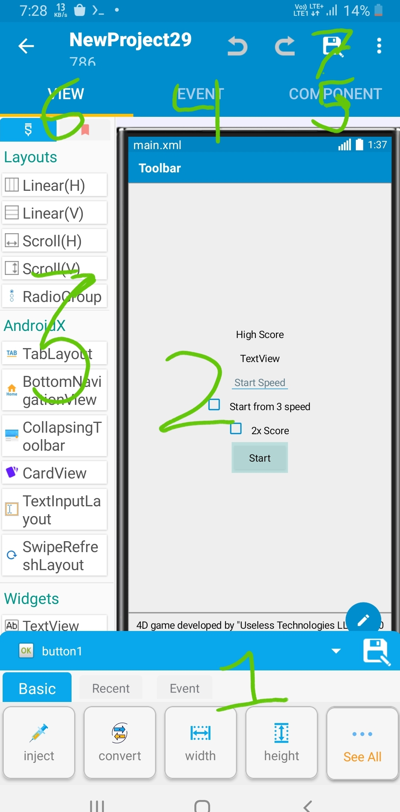

# Sketchware Pro

Let's discover **Sketchware Pro in less than 5 minutes**.
You can download Sketchware Pro from [here](https://github.com/Sketchware-Pro/Sketchware-Pro/releases).
# What Sketchware Pro is
Sketchware Pro is a Android IDE which works on Android. You can create Android apps without writing even a single line of code.
# Layout
Here is the layout of Sketchware Pro.

1. View editor

From here you can change properties of a View. Width, Height, Padding etc. are some properties.

2. All Views

From here you can add a view to your app's layout. It can be a button, TextView, EditText or any other supported view.

3. Layout Preview

This is the preview of your app's layout(design).
:::danger Notice
This is not exact same preview, it can be different after compilation.
:::

4. Events

Events describe what will happen and when.

5. Components

To make your apps more powerful, you can use [Components](category/components).

6. View

The layout(design) of your app is in the [view](category/views) section.

7. Save button

Once you have done the hard work, save your project from here.

There is also a "Run" button in bottom to compile your project and test it on your device.

