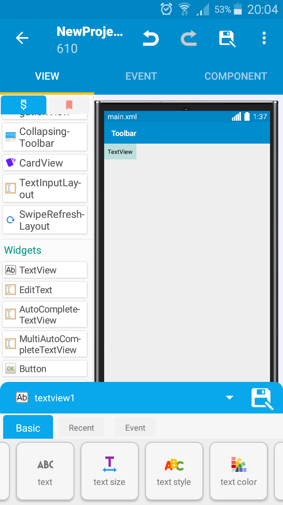
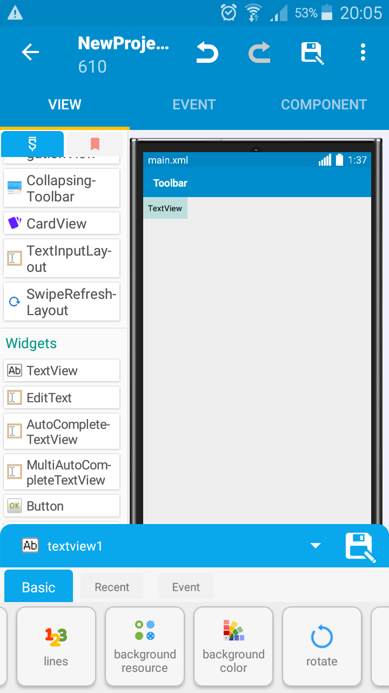

# TextView
TextView is a part of android framework.

## Using it
First, add it to your Activity.

 As you see there are many properties for TextView and for using them :
 
 |property name|using for|
  | ---- | ---- |
 |text| setting text of the TextView|
 |text size | setting text size of the TextView|
 |text style| setting style of the TextView and sections is normal , Bold,Italic ,Bold&Italic|
 |text color| setting text color of the TextView|
 |text lines| setting lines of the text in TextView|
 |background resource| setting background of TextView as Image|
 |background color| setting background color of the TextView|
 
 # Blocks of TextView
  ... 
 
 
