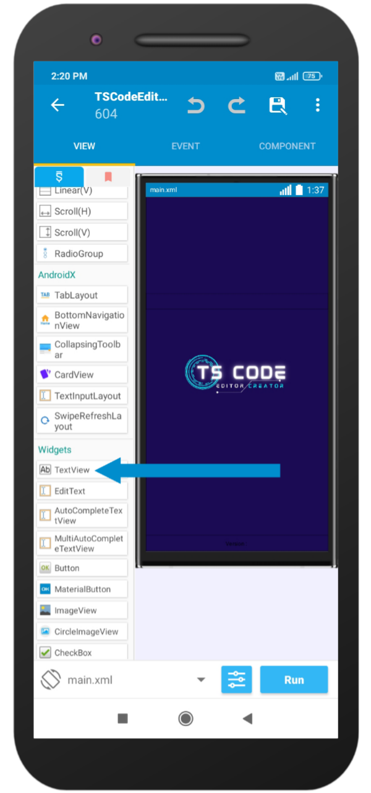

## TextView

### Introduction
A TextView is a simple piece of text that can be displayed on the screen in your Sketchware Pro project. You can use a TextView to display messages, labels, or even just plain text. You can also style your TextView to change its appearance.
In this documentation, we'll cover everything you need to know about using TextViews in Sketchware Pro. We'll start with the basics of what a TextView is, and then move on to creating and styling your own TextViews. We'll also share some tips and tricks for using TextViews in your projects. So let's get started!

### What is a TextView?
A TextView is one of the most common UI components used in Android development that allows you to display text on the screen. They are often used for labels, descriptions, headings, or any other static text that needs to be displayed.

### Creating a TextView In Sketchware Pro.
Creating a TextView In Sketchware Pro, creating a TextView is a straightforward process. Follow these steps: 
- Open the project where you want to add the TextView.
- From the components pane on the left-hand side, search for "TextView" as shown in below image and drag it to the layout screen.

- Click on the dragged TextView, it will open property editor from there you can customize the TextView's text, color, size, and font.
- The TextView is now ready for use. Styling a TextView In Sketchware Pro, you can easily style the TextView to improve its appearance.

Here are some of the ways you can style your TextView:
- Change the text color: In the Properties menu, you can change the text color of the TextView under the `text color` property.
- Change the font size: You can adjust the font size of the TextView under the `text size` property.
- Add a background color: You can add a background color to the TextView under the `background color` property of the Properties menu.

Tips and Tricks Here are some tips and tricks to help you make the most out of using TextViews in Sketchware Pro:
- Use TextViews to display simple text messages, labels, and headings.
- Use different font sizes and styles to create visually appealing design elements.
- Use background colors and text color to draw attention to specific TextViews.
- Use TextViews alongside other components such as Buttons, EditTexts, and ImageViews to create more complex layouts.
- Be mindful of text placement and ensure that the TextViews are readable and easy to understand.

By mastering TextView, you can create beautiful layouts that can catch the attention of your users. Use the different styles available to make the text stand out, and don't sacrifice readability for the sake of design.