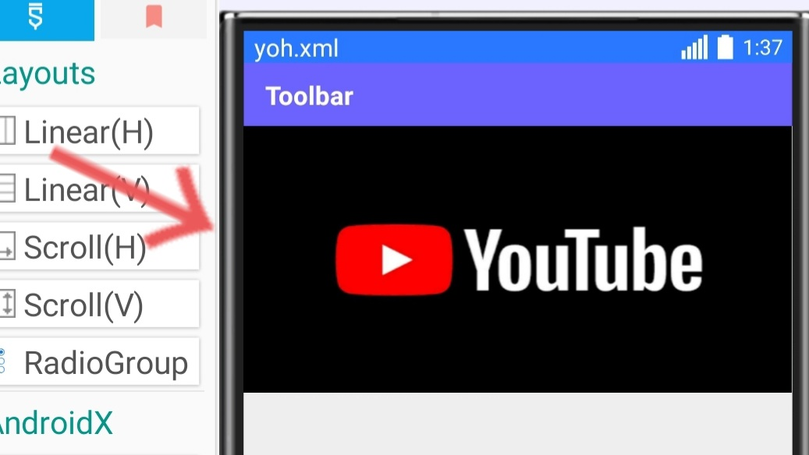
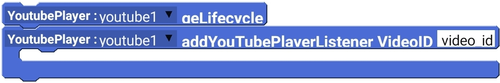

# YouTube Player
YouTube player is used to show YouTube videos in your app.

:::danger AppCompat required 
To use YouTube Pla, you must enable AppCompat first, otherwise, you will see an error.
:::

## When to use YouTube player
Sometimes you need to show a YouTube video in your app. For example, a new user has registered and they don't know how to use your app. You can make a YouTube video on it and show to users without letting them leave your app.
## Get Started
First off, you will need to choose a YouTube video that you want to display.
Find the video and copy its sharing URL.
Then the whole URL is not needed. You need the video's ID. To get it, follow these instructions:
Get the url, and remove https://youtu.be/ from it.
For example, a video URL is https://youtu.be/dQw4w9WgXcQ then the ID of this video would be `dQw4w9WgXcQ`

Now you are done with this part.
## Implementation
 Now its time for implementation.
 
1. First, you will probably need to add a YouTube player in the activity.
 
 After adding it you may change the width, height etc.

2. Open the onCreate event(or any other event that you want to initialize YouTube player on)
3. Add YouTube player getLifecycle block and a AddYouTube playerListener VideoID block.

4. Compile & Run the app.

That's it. You have successfully implemented YouTube player in your app.