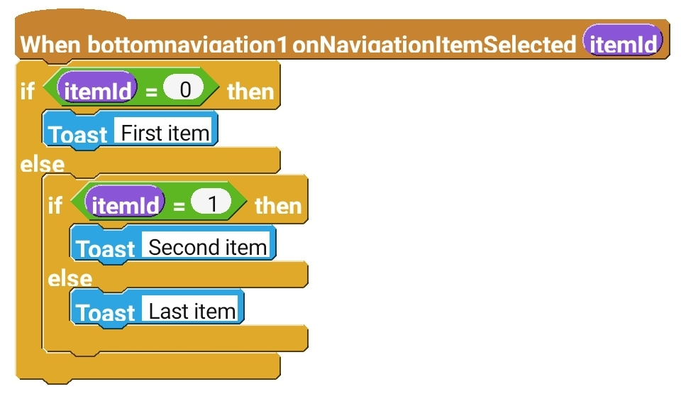

## Bottom Navigation 
Bottom navigation is a common UI design pattern that allows users to navigate between different sections of an app by selecting one of the items on a bar at the bottom of the screen.
Bottom Navigation View is a part of Material Design library. Sketchware Pro supports it out of the box.

## Using it
First, add it in the bottom of the Activity.
Then open the onCreate event and add this block:

Block fields:

  | Name | Type | Use |
  | ---- | ---- | --- |
  | BottomNavigation view | BottomNavigation | The bottom navigation view you're messing with |
  | Item ID | number | The ID of the item. You can set 0 for first item, 1 for second, and so on
  | Title | string | Title of the Item |
  | Icon | Image | Icon of the item. Add a image in Image manager and select it here |
  

Now open onNavigationItemSelected event. 

The above code would show a toast saying `First item` when first item is selected, `Second item` when second item is selected, and so on.
## Events
### onNavigationItemSelected

  | Name | Type | Use |
  | ---- | ---- | --- |
  | itemId | number | The item of ID which is currently selected by user |