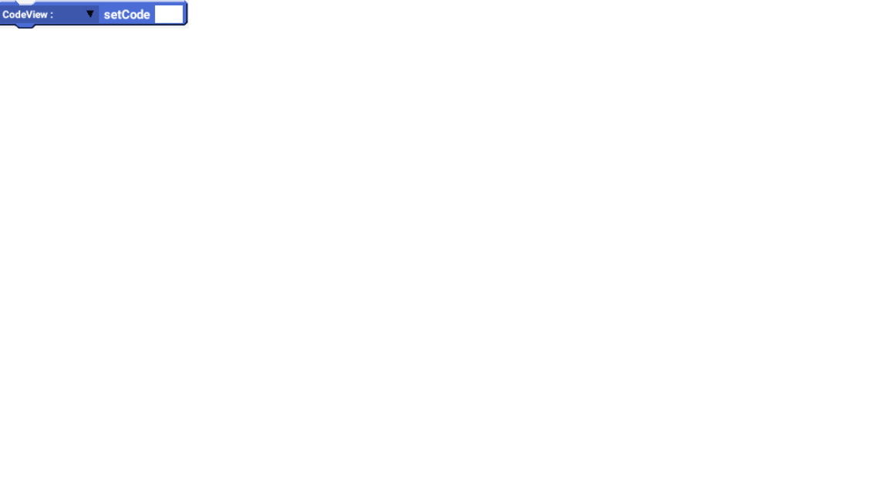
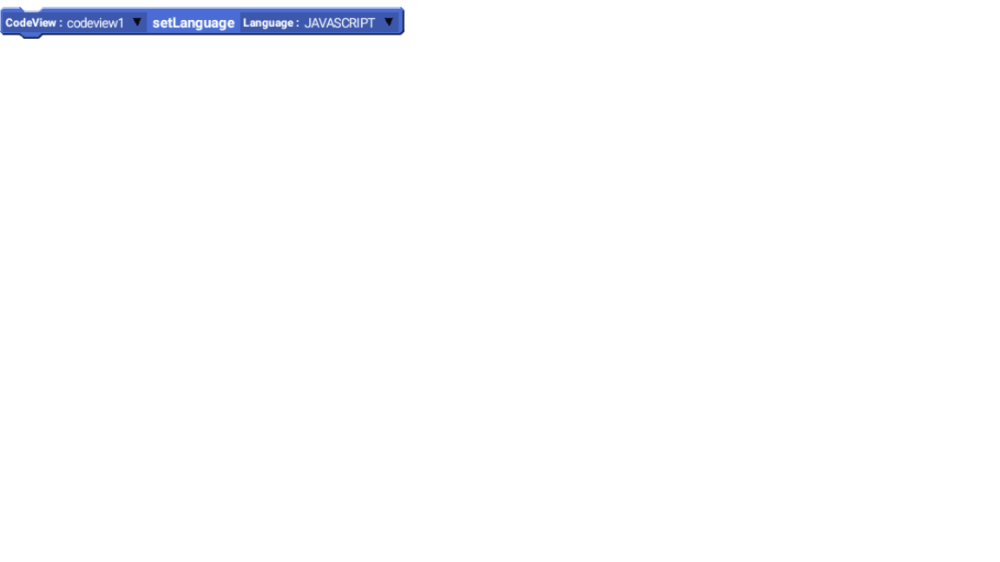

## Blocks
### Set Code

  | Name | Type | Use |
  | ---- | ---- | --- |
  | CodeView | CodeView | The code view you're messing with |
  | Code | string | The code that you want to display in the view |
  
  ### Set Language

  | Name | Type | Use |
  | ---- | ---- | --- |
  | CodeView | CodeView | The code view you're messing with |
  | LanguageSelector | list | The code that you want to display in the view |
  